## はじめに
赴日旅游每个人的目的不同，定的行程自然也是千奇百怪，有经典的京阪神一线，有专门去深山老林的深度游，也有极端类似清晨出发台场购物三日游的。本文不是说明怎样定行程，而是用不是很简洁简洁的文字把通常可能会提出的问题以及注意点集中一下。
* 请在通读各大网站的赴日旅游常识后在读本文。
* [*斜体字*](#comment)所标出的词汇说明在附记部分有单独说明。

## 护照
全国大部分<del>开化</del>地区实行[按需申领](http://vacations.ctrip.com/notes/2517.html)，通常凭身份证户口本（非当地户口通常还需要居住证，具体各地不同，需查询当地出入境管理部门网站），只有少数<del>未开化</del>地区仍然需要“按条件申领护照”，这部分地区的朋友们还请<del>你们的父母</del>各显神通。

## 签证
签证其实按步骤不要摸就行了，由于地域以及个人/家庭条件的因素每个人需要准备的东西基本都不一样，具体需要的资料就按照旅行社/签证代理的要求做就好。

---
#### 以下是不含个人看法的申请常识，重要部分已经用粗体标出

* 旅游签**只能通过制定旅行社送签，不能个人提交使领馆**
* 旅游签证种类按次数和日期大体分为单次，三年多次（需/不需激活）和五年多次，详见各大网站，这里不展开
* **根据生活地点（非户籍地）的不同，提交的使领馆不同，详见[*指定送签社*](#travel)**，详见淘宝或驻华大使馆主页的签证申请介绍部分。各使领馆的旅游签介绍页内也会有*指定送签社*以及各自状态的介绍，请多加利用。
* 任何提交方式到使领馆后审查的流程及标准都一样
* 并非提交的所有资料都送到使领馆，旅行社会筛查很大一部分资料（这里资料主要指的是**经济证明**，下同）并做担保，所以会有所谓 “**简化资料**”，这些材料有通过的可能性，但同样拒签的风险更大，见下
* 使领馆会抽查旅行社担保的资料，一旦不合要求，资料不足的会要求补充，浪费时间，补不出来旅行社通常会申请终止（即放弃申请，负面影响相对较小）；资料虚假的那就回家等死吧。
* 最大的风险是，你少提交的材料不知道旅行社会不会帮你做假，导致你背黑锅，后果通常就是拒签+旅行社停签。旅行社的停签记录会挂城墙在使领馆官网上可以查到。个人被拒签半年内不能申请同类签证，之后一辈子每次申请都需要陈述原因，通过率也可想而知。
* 使领馆费用是公开的，你交的费用-该费用=代理收费，<del>然而知道这个并没有什么卵用</del>
    * 单次：冲绳免费，其他200（理论上东北三县也应该免费，但好像还没见过有旅行社办这个的）
    * 三年多次需激活（年收10w）：[*东北三县*](#northeast)或冲绳免费，除三县外的[*东北六县*](#northeast)400
    * 三年多次不需激活（年收20w），五年（年收50w）：400

---
#### 以下是主流申请方式的横向对比以及个人主观看法，不完全正确，仅供参考。

* **原则：按自己的出行计划和能提供真实材料的最大限度选择，千万不要勉强**

* 地元旅行社（[*指定送签社*](#travel)）
    * 有利点：最稳妥的申请方式，有送签权的线下店通常会严格按标准审核材料，真人沟通（？），收材料后通常也比较稳，个人信息风险小
    * 不利点：常规方式里收费会相对稍高，由于地元申请资料需旅行社寄送到领馆当地速度较慢，资料审核有时候会比较死板
    * 中老年人较常见的选择

* 大手旅游网站/官方微信/APP（X程，X途之类）
    * 有利点：审核相对严格，出签较稳，价格上也比较合适（通常低于旅行社），通常申请后的进度查询也较方便，处理速度较快，个人信息风险小
    * 不利点：收费较淘宝相对较高，材料较死板
    * 较常见的选择
    * 特别注意：大手网站有些同时经营自营签证业务以及代理业务，代理业务的优缺点需参照下一条。X猪无自营业务，均为代理。

* 淘宝中的代理旅行社
    * 有利点：材料审核相对柔软，通过率相对较高，由于竞争激烈收费在常规方式中最低，处理速度也较快
    * 不利点：鱼龙混杂，资料介绍页面五花八门，需要自己辨别以及与客服沟通，部分不良旅行社也有类似下述个人代理的漏材料甚至造假行为，个人信息风险一般
    * 较常见的选择，选中靠谱的店铺是关键，实在难以辨别，按销量排也是个办法

* 个人代理（个人微信、各种评论以及广告里链接到的网站、部分所谓专做签证的APP）
    * 有利点：材料相当柔软，通常只要钱给够什么材料都敢送，专人服务
    * 不利点：收费通常较高，在资料不全的情况下会开出天价，风险极大（由于没有第三方监管，即使被拒签也难以找到对方），个人信息风险大
    * 通常不应该作为选择，只有材料条件不够但又相当想去的人才会到处找个人接这种有风险的单

## 机票
先补充一个常见QA：先订机票还是先办签证？我的看法是：就日本来说，根据你对自己材料的自信程度决定。如果你的材料完全满足使馆公布的材料，那先订机票确定行程完全没有问题。

---
#### 买什么航空公司？
看图说话

以上有八成是胡说的。实际情况要按照上述条件综合判断。

* 说中日机票前需要先了解一些国际机票常识，有点多就不展开了，请自行搜索：联程票，往返票，中转，海关，边检等
* 如果时间紧张又不住在一线城市附近，上面的表根本不用看了直接找最近有直飞的航班就好。一个提示：在日本转机比在国内转机需要花的时间少不少，从三线城市N到东京如果有N-大阪-东京及N-上海-东京两条路的话通常前者会比较快（费用也比较高）
* 单纯希望买到最便宜机票的话，[*LCC*](#lcc)通常是首选。然而买LCC的票前务必看清：你买的票里带什么服务，尤其是**行李额**，即使你在机上不吃不喝不选座位，如果你去的时候带了箱子，回来的时候买了一大堆东西（超过航空公司规定的手提行李重量或尺寸），那托运还是不可避的。横向对比机票价格时，需要看清票价内包含的服务。在带的行李较多的情况下（尤其是淡季），LCC的机票总价格与全服务航空公司不差多少甚至更高。
<!---
另行制作：票价服务表/计算插件
-->
* 现实里大家通常都不会这么极端...通常会将性价比综合考虑。如果要简单归纳的话，淡季/工作日去买LCC通常会比较划算，高峰期则差距较小。
* 建议出行前至少提前两个月开始准备机票，提前半年也不为过，尤其是准备买大手航空的情况。

---
#### 在哪买？怎么买便宜？
同样涉及到两个因素：价格以及机票售后。
一切正常的情况下，在哪买的机票享受的服务都是一样的。但涉及到需要退改机票，延误后的处理，原则上**你找谁买就要找谁处理机票售后事宜**，因此会有所不同。

* 线下售票点
    * 有利点：一对一服务，可以即刻取得行程单，不需要自己输个人信息不怕输错
    * 不利点：价格不透明，短暂的对话里你并不能了解机票的所有限制条件
    * 对于年轻人不应该也估计不会是购票的首选
* 大手旅行网站/微信/APP（第三方购票网站）
    * 有利点：网站界面清晰，含税价格对比通常十分透明，购票流程简单，目前购票的首选之一
    * 不利点：机票限制条件鱼龙混杂，需要仔细辨别，退改时如果留了坑有可能被收取高额退票费（插一句，国外退票费超过机票价格的case是存在的），常被捆绑购买各种套餐保险
    * 购票时，从查询界面开始，各种小弹窗/补充说明都需要**仔细查看**，总之就是细心再细心。第三方网站价格确实有时候很优惠，需要花时间好好对比一下。
* 航空公司**官方**网站/微信/APP/客服电话订票
    * 有利点：价格透明，改退票方便（有特例：见下），套路相对较少，客服方便（通常直接打航空公司客服电话即可）
    * 不利点：无法与其他航空公司横向对比价格，很多航空公司的网站怎么说呢...系统感觉几百年没更新了很不好用
    * 购买外航小公司、不会外语的话，在国外出现非正常情况会很难受。
* 微信朋友圈国际机票票务代理
    * 有利点：给钱就是了，啥都不用你操心
    * 不利点：上面所有涉及到售后和价格的不利点加起来
    * 主要流传于国外留学圈的選択肢，我个人是没有体验过，大忙人以及傻多速的选择

实际操作中通常会结合起来操作，最常用的就是票代横向比较价格，再去航空公司官网买。购票后发出的行程单是申请签证以及入关时的重要证明，务必打印**纸质版**后妥善保管。

## 宾馆
这个处理起来最简单，日本并没有类似国内酒店部分只能接待内宾的制度，只要你订的到不管啥途径（包括电话订）都一样。但考虑到资料来源，交流难易度以及便利性等因素，综合下来也基本就剩在线网站预定一择了。有朋友曾经问类似能不能订APA这种问题的话，我只能说问起来没意思答起来也没意思，见仁见智吧。 
比起选网站，选酒店更多的需要的是地理位置技巧，并且搭配你的交通方式（特别是购买的通票）。

* **靠近铁路车站远比靠近著名景点重要**，毕竟你不会是只去一个地方<del>类似台场三日游、SSA三日游的行程除外</del>。下了电车再打车的玩法真不如加钱住的离车站近。
* 注意宾馆的取消政策，计划赶不上变化，通常无法取消的房间费用会更便宜。
* 虽然是旅游常识，日本酒店的开房时间通常从入住日14～15点开始，不允许提前入住，不过可以当日先把行李寄存过去；最终日退房时间一般是上午10点，超过时间基本上要加钱，务必事前了解。

---
test
- [ ] hoge
- [x] fuga
- [ ] piyo

--
## 附记：词汇说明
* **指定送签社**
    * 大使馆：
    * 上海总领事馆：
    * 广州总领事馆：
    * 成都总领事馆：
* **东北三县/东北六县**
    * 东北三县：岩手县、宫城县、福岛县
    * 东北六县：上述三县加青森县、秋田县、岩手县
* **LCC/廉价航空**
    * Low-cost carrier，廉价航空，比起普通航空公司（下称大手），行李、餐饮、座位宽度、延误时的后续处理都有所折扣，购买前需要自行前往航空公司网站了解。

